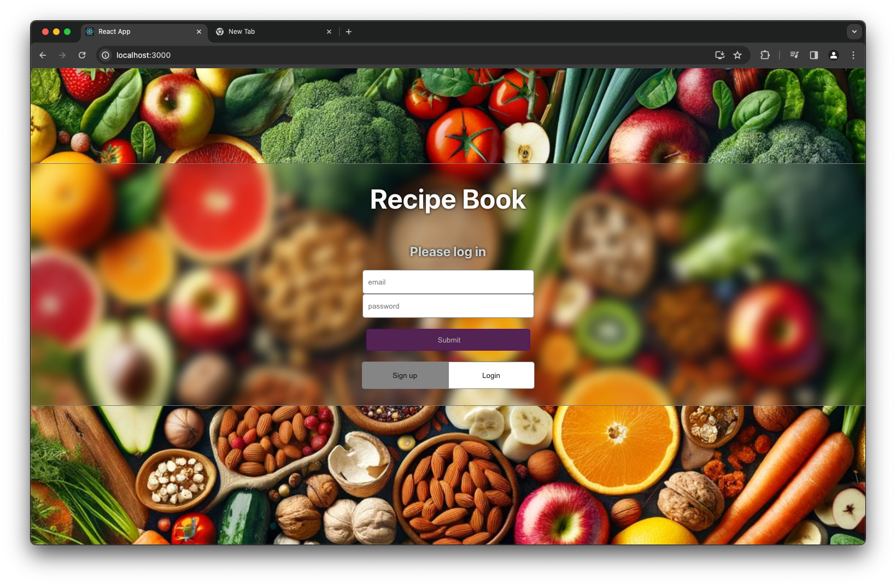
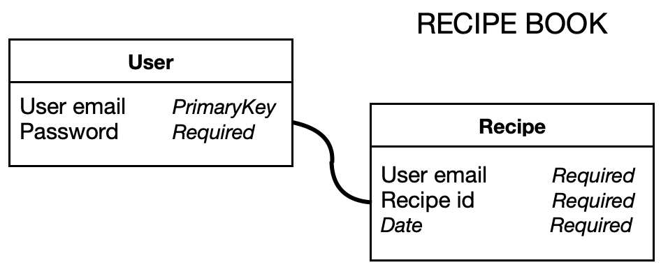

Welcome to our Recipe Book App, where culinary delights await you at every swipe! Whether you're a seasoned chef or just starting your culinary journey, our app is your passport to a world of flavors, aromas, and tantalizing tastes. Dive into a treasure trove of recipes meticulously curated to inspire your inner chef and tantalize your taste buds. From mouthwatering mains to delectable desserts, we've got something for every craving and occasion. Get ready to embark on a culinary adventure like no other, where every recipe is a story waiting to be told and every dish a masterpiece waiting to be created. Join us as we journey through the art of cooking and savor the magic of flavors that bring people together. Welcome to your new kitchen companion – let's start cooking!



HOW TO RUN 
------------------------------------
```bash
  npm run build 
  psql < ./server/data.sql
  npm run start
```

TECHNOLOGY STACK USED
------------------------------------
* postgres
* express
* css
* node# stage-two

API USED
------------------------------------
https://spoonacular.com/food-api
- User: This entity stores the user's email and password. The user email serves as a unique identifier or a username for user accounts within the application.
- Notes: This entity is related to the user and to store various pieces of information created by the user. Each note has a unique identifier (user email), the user's email (linking it to the User entity), a title, the content of the note itself, a date (presumably the date the note was created or last modified), and a recipe id (which suggests that notes can be associated with specific recipes).
- User (Recipes): This is to be a second instance or aspect of the User entity, which is specifically related to recipes. It holds a recipe id and a recipe title, indicating that users can create or store recipes within the application.
- GET https://api.spoonacular.com/recipes/random
- When you make a GET request to this endpoint, you're essentially asking the Spoonacular API to provide you with a random recipe. This could be any recipe from their database, selected at random by the API's algorithm.

In practical terms, when you send this GET request, your client (such as a web browser, a mobile app, or a script) communicates with Spoonacular's server. Spoonacular's server then processes the request, selects a random recipe from its database, and returns the details of that recipe in a structured format, typically in JSON (JavaScript Object Notation) 

DATABASE SCHEMA
------------------------------------


DATABASE INFO
------------------------------------
This entity manages the user's login credentials, utilizing the email as a unique identifier or username within the application. Additionally, there is another aspect of the User entity, User (Recipes), which is specifically dedicated to recipes. It includes fields for a recipe ID and title, enabling users to create and store their recipes within the application.